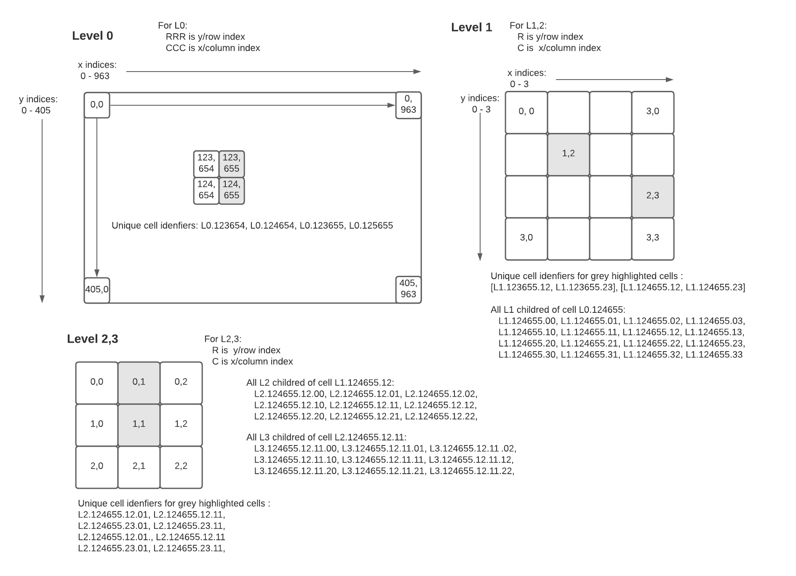
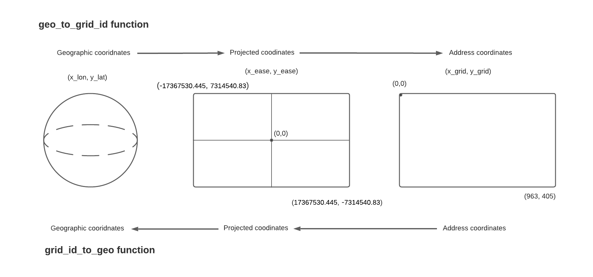
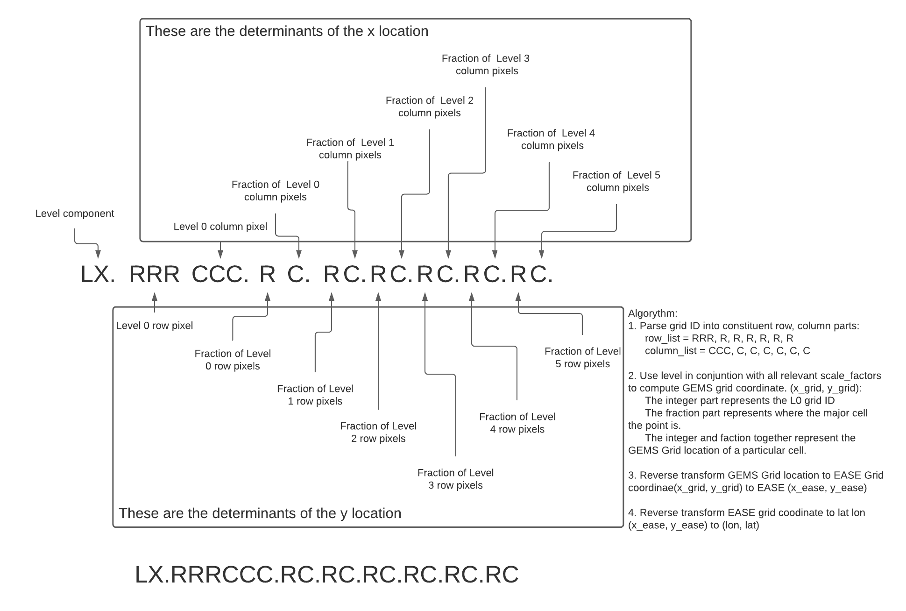

© Regents of the University of Minnesota. All rights reserved.

This software is released under an Apache 2.0 license. Further details about the Apache 2.0 license are available in the license.txt file.

# gemsgrid
All things relating to the GEMS Grid (DGGS) Soution

## Setup
GEMS Grid is now installable as a library! To install the library, simply:
   + clone/pull the repo to your local environment
   + cd into the repo directory
   + `pip install .`

## Usage
Once the package has been installed, you can use the functions as you would any other package. For example:

```
# load the library as you would any other library 
import gemsgrid.gemsgrid as gg
```

To faciliate reuse and reproducability, the grid and levels specification parameters have been moved to external JSON files.
   + Grid specifications are in: `src\gemsgrid\grid_spec.json`
   + Level specifications are in: `src\gemsgrid\levels_spec.json`

NOTE: is it approrpriate to use __init__.py to load those json files into dictionarys that can then be referenced within the library or the common_tools?

### Usage of `common_tools`
To be expanded as we add 

## Background information the GEMS Grid
This section is intended to provide an understanding of the GEMS Grid. The GEMS Grid is a hybrid Discrete Global Grid System. Much of what is below is now described in the publication [EASE-DGGS: a hybrid discrete global grid system for Earth sciences](https://dx.doi.org/10.1080/20964471.2021.2017539).

### Uber H3
An early contender, due to:
 + Sizeable user community
 + Satisfied most/all of the OGC Criteria for DGGS
 + Hexagon's make some applications (pest dispersion, market navigation)
 
Disadvantages:
 + Lack of support in existing geospsatial software (e.g. can't import layer with native H3 'projection')
 + Existing spatial algorythims all need reworked for hexagons
 
Fatal Flaw for GEMS:
 + Lack of perfect child containment (mathematics of resampling to high resolutions are not invertable)
 
### EASE Grid v2 
Advantages:
 + Used for to store several data for several satellite missions
 + a projected grid: (distorions easy to understand)
 + Maleable to GEMS needs (mainly a 
 + EPSG code makes the coordinate system for the grid compatable with existing GIS 
 
Disadvantages 
 + Componets exist for a hierarchical system, but noone yet applied a DGGS framework (e.g. no one has yet specified how to grid cells numbered/filled/identified
 
 
 #### Grid Specs


this indicates that the aperature is not fixed, so is something of a hybrid. 36 to 9: aperature 4, 9 to 3: aperature 3: 3 to 1: aperature 3

if I wanted 1km to 100 m: aperature 10; 100 m to 10 m: aperature 10
 
 ### Options for Cell Naming/ordering conventions
 
##### Address/Indexing Scheme
The bit-mask range idea can be modified, to form a more human readable. The idea would be, address/index location. Again, some specification of Row or Column ordering woudl be required, but the basic scheme would be something like:

LX.RRRCCC.RC.RC.RC.RC.RC.RC

Here: 
 + L = shorthard for 'level'
 + X = integer indicating level of heirarchy;
 + R = Row index; 
 + C = Column index. 
The `.` is used to make it human readable, and also tells you what the row/column index is for a given level. Using a 0-9 numbering scheme also means that the addressing is compact, single digit for each Level 1-6. 

The Address-Indexing Noation is represented in the figure below.



This scheme is extensible, meaning that the Level 6 need not be the 'final' resolution suppoted. Level 6 corresponds to ~1 m resolution. Aperature 10 on 1 m would result in cells ~ 0.1 m, or 10 cm. Though convenient, most geospatial professionals will not be equiped with survey grade, precisions GPS kit. 

 ##### Address-Indexing mapped to bit-mask notation
 One idea is to use 64 bit memory space and partition it to indicate parent/child relationships. Efficient on memory space, but not so user friendly. Here, some version of column or row major partitioning whould be implmeneted. Thinknig of working in row major order, a partent would 
 
 
| Bit Range | Type  | Description |
| --- | --- | --- |
| 0 - 6 | Bit flag  |  indicating level of heriarcy.  |
| 7 - 15 | Integer |  indicating Level 0 row.  | 
| 16 - 25 | Integer |  indicating Level 0 column.  | 
| 26 - 29 | Integer |  indicating Level 1 pixel location in Level 0 cell. Can map the index to product of level 1 row * column   |
| 30 - 33 | Integer |  indicating Level 2 pixel location in Level 1 cell.  Can map the index to product of level 2 row * column |
| 34 - 37 | Integer |  indicating Level 3 pixel location in Level 2 cell. Can map the index to product of level 3 row * column  |
| 38 - 45 | Integer |  indicating Level 4 pixel location in Level 3 cell. Can map the index to product of level 4 row * column  |
| 46 - 52 | Integer |  indicating Level 5 pixel location in Level 4 cell. Can map the index to product of level 5 row * column  |
| 53 - 59 | Integer |  indicating Level 6 pixel location in Level 5 cell.  Can map the index to product of level 6 row * column |
| 60 - 63 | -  | unused |


#### From lon,lat to GEMS Grid ID and back again

Converting from real-world geographic coordinate pair (lon, lat) to GEMS Grid ID and back is the first step needed to operationalize the GEMS Grid. In simple terms, there are two transforms involved in this operation. These overview steps are outlined in the figure below. Going from geograhpic cooridnates first involves transforming into EASE Grid v2 coordidnates. These coordinates are are projected and the basic units are Eastings, Norhtings which are measured in meters. From there, the second step is to recenter that grid, and transform to a smaller number space. This transformation made it easier to work with the data, as the large numbers involved in EASE Grid made the book keeping and computation harder to keep track of. 



Going from GEMS Grid ID to geographic cooridnates is basically the reverse. Since the cell ID is basically a positional index, its simply a matter of converting that index to cooridnate pair on the GEMS Grid (x_grid, y_grid), reverse transforming that to EASE grid cooridnates (x_ease, y_ease), and then converting those to lon, lat (x_lon, y_lat). 

Note, going from geograhic coordinates to GEMS Grid ID and then back will **not** produce identicle results. Upon completing the cycle, the cooridnate that is returned represents the centroid of the grid cell. This is a property of Discrete Global Grid Systems, and it requires a user to think about the positional accuracy of their data. While it is possible to describe _relative_ spatial accuracy to the nano-scale or beyond, current state of the art in GPS technology effectivley only allows _absolute_ locational accuracy down to about the centimeter scale.    


If not, this seems like a spatial recursion problem. Find the intersection of supplied cooridnates in L0 cells. Next, find interscetion of point in L1 children cells of the specific L0 cell. Next find interscetion of point in L2 children cells of the specific L1 cell. Recurse until specific cell location at desired Level is identified.  

Code for the schematic with grid ID parsing and 

test2


