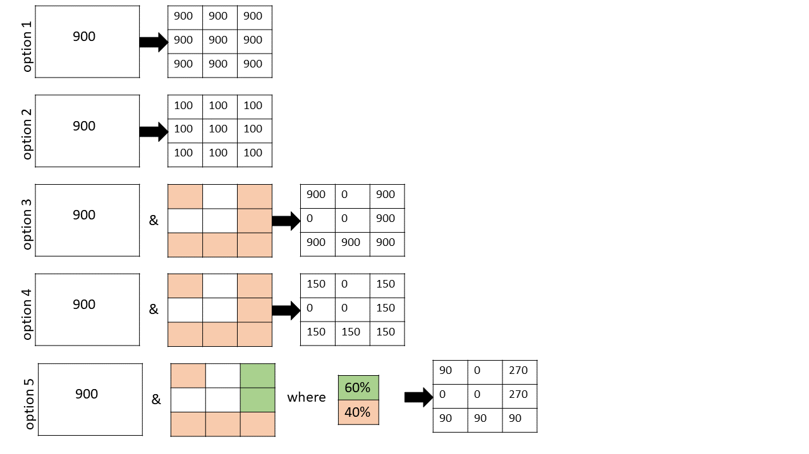
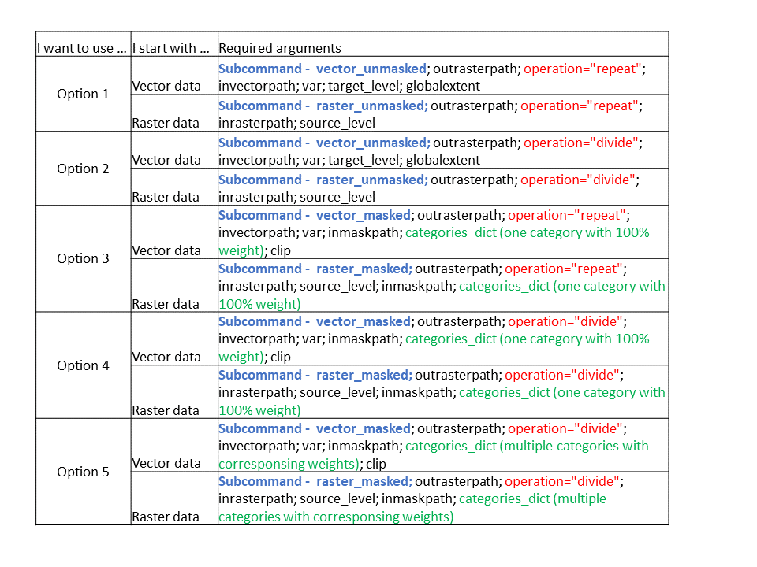

# GEMS Disaggregation

## Overview

Raster disaggregation functions allow to resample GEMS raster datasets from coarser to finer level (for example, from level 1 to level 2). A "parent" is defined as a pixel (or a grid point) of the coarser data, and all pixels of the finer level contained within a given "parent" are its "children". Number of children would be constant across space and would only depend on the refine ratio between the source and the target GEMS levels. 

Vector disaggregation functions are meant to rasterize vector datasets to a specified GEMS level. In this case, a "parent" is a polygon, and "children" would be GEMS pixels inside the polygon. In this case a number of children would NOT be constant across space; it will vary depending on the size of the polygon and the desired target GEMS level.

The following 5 disaggregation options are supported for both raster and vector data:

- option 1 - repeat parent value to all children
- option 2 - divide parent value by the number of children
- option 3 - repeat parent value to valid children
- option 4 - divide parent value by the number of valid children
- option 5 - divide parent value by the number of valid children corresponding to multiple categories with different weights

## Disaggregation Tool Specifications

### Define required arguments

### Guidelines for building mask conditions  
- For options 3 and 4 use a dictionary with only 1 category with weight 100%.
Example: `categories_dict = {1:["mask==1",100]}`
Multiple classes within the same category are also supported: `categories_dict = {1:["(mask==1)|(mask==5)",100]}`
- For option 5 use a dictionary with 2 or more categories and their corresponding weights:
Example: `categories_dict={1:["mask==1",60],2:["mask==5",40]}`
- use `|` operator to meet either condition. With `"(mask==1)|(mask==5)"` you will select pixels that equal to 1 or 5
- use `&` operator to meet all condition. With `"(mask>=24)&(mask<=67)"` you will select pixels with values higher than 24 but lower than 67.

### Usage examples
- Disagregate raster data to a finer level   
`(geo) C:\Users\***>python disaggregate.py -or outrasterfile.tif -o repeat raster_unmasked -ir inrasterfile.tif -sl 1`

- Disagregate raster data to a finer level with mask data as additional input  
`(geo) C:\Users\***>python disaggregate.py -or outrasterfile.tif -o repeat raster_masked -ir inrasterfile.tif -sl 1 -im inmaskfile.tif -cd {1:[\"(mask==1)|(mask==2)|(mask==3)|(mask==4)|(mask==5)\",100]}`

- Disagregate vector data  
`(geo) C:\Users\***>python disaggregate.py -or outrasterfile.tif -o divide vector_unmasked -iv invectorfile.shp -v totalvalue -tl 4 -g False`

- Disagregate vector data with mask data as additional input  
`(geo) C:\Users\***>python disaggregate.py -or outrasterfile.tif -o repeat vector_masked -iv invectorfile.shp -v valueperac -im inmaskfile.tif -cd {1:[\"(mask==2)\",100]} -c True`
